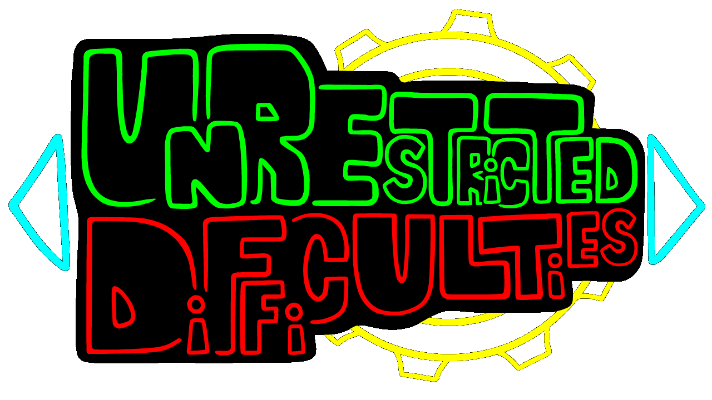

# Unrestricted Difficulties

The Unrestricted Difficulties framework is a soft-coded FNF mod, which gives FNF modders more control over difficulties and variations.

> [!CAUTION]
> ## Usage as dependency for other mods
> Previously, I had a section on gamebanana that explained how to bundle this framework with your mod, but now I want to suggest the exact opposite: **DON'T BUNDLE THIS FRAMEWORK WITH YOUR MOD AT ALL!!**. Instead, you should tell your users to download this framework separately, and then download your mod. This way, your mod will be more future-proof, and you won't have to worry about updating this framework in your mod's download every time I update this framework. If you want to make sure your mod won't load when this framework isn't installed or just make sure this framework loads before your mod does, you can add it as a dependency to your mod's metadata and use polymod's [dependency behavior](https://polymod.io/docs/dependencies/).
> 
> Also make sure you package your mod with a folder with the mod's proper name inside the zip, so people will be able to extract it, because append logic and dependency behavior won't work otherwise.

## Features

The framework includes the following features:
- Makes your custom song variations appear in freeplay (was relevant before 0.4.0, but now it's already implemented in the base game) and story mode (story mode is still relevant).
- Adds a variation injection system, which lets you inject your variations into existing songs, without overriding their default metadata files.
- Adds a variation-specific song script system, which lets you create song script for existing songs, which will only be used when a specific variation is selected. This is useful for creating custom cutscenes, custom mechanics and more for specific variations.
- Adds a difficulty sorting system, which orders difficulties in freeplay and story mode according to priority numbers.
- Support for custom difficulty sprites in the result screen (was relevant before 0.4.0, but now it's already implemented in the base game), which can also be animated (animations are still relevant).
- Adds difficulty display name system to the pause menu (and hopefully to the discord RPC too when it gets added to FNF), which lets you make the difficulties' display names different from their IDs. This allows different difficulties to have the same display name, while still having different IDs, which makes the menus distinguish between them. If you don't define a display name for a difficulty, the framework will use difficulty display name trimming, which will trim a difficulty's variation name from the difficulty's name when it gets displayed if its name starts with the variation name (this doesn't apply to difficulty names that are the same as the variation name).
- Improved story mode menu, with the following key improvements:
  - Limits the range of difficulties you can choose from and changes the song list according to the songs and difficulties available in each level, as opposed to relying on a constant and displaying only `easy`, `normal` and `hard` (which means you can play base game levels on `erect` and `nightmare` difficulties from the story mode menu using this framework).
  - Adds custom story mode menu script events (`UD_STORY_ENTER`, `UD_STORY_SCROLL`, `UD_STORY_EXIT`, `UD_STORY_CONFIRM`), which get called on modules.
  - Lets you inject alternative data to a level for different variations\difficulties available in the level, meaning you can customize how a level looks in the story mode menu (and even add songs under specific requirements) when having specific difficulties selected.

## Extension: Customizable song scripts

Adds special attributes to all of the song scripts, which you can set using `scriptSet` on `onCountdownStart` through a module, as opposed to overriding the scripts, to customize the script's default behavior (which includes cutscenes and more song-specific stuff). This was deprecated in favor of variation-specific song scripts, but was kept as an extension for compatibility with mods that use it. The extension download can be found on the [gamebanana page](https://gamebanana.com/mods/512797).