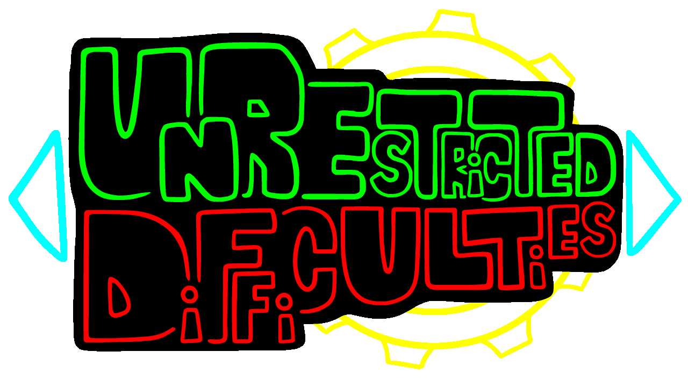

> [!IMPORTANT]  
> This mod only works on V-Slice 0.5.0. Don't try to run it on any other version, because it will have bugs and errors.
> 
> I am planning to split this mod into multiple, smaller, simpler mods, which will include the features that are still relevant in the latest
> versions of FNF. My current plans are as follows:
>
> 1) Variation-specific song scripts - I tested this feature on FNF 0.7.3 and it worked perfectly fine as far as I'm aware, so giving this it's own mod would be a good idea imo. I also think no one even noticed I added this feature to UD last year (BECAUSE NO ONE USED IT!!!), So I hope this feature will finally get the spotlight it deserved!
> 
> 2) Animated difficulty sprites on result screen - This is a very small feature, but it's neat, and I bet some modders would want a dependency like this, so why not?
> 
> 3) Unrestricted story mode menu difficulties - For those who don't know (which is most of you), this was the first goal (and the first name) of the Unrestricted Difficulties mod. YEP, This mod was originally only about the story mode menu, but because there was demand for more features and I was willing to keep working on the mod, the mod's scope was expanded and the name was changed, which was a MISTAKE, because this kind of mod, which makes use of very specific stuff in the game's code and will break for every small change, was destined to be very hard to maintain in such a scope on my own and ESPECIALLY in a game that includes breaking changes in almost EVERY UPDATE! So what I want to do with this one is take story mode related features from UD and give them their own mod. From what I tested, there are some bugs with some of these features, so making this work will be a bit more tricky, and some features might be removed. To be honest, I'm not sure if I'll really work on this one, but the idea is there and I guess it's POSSIBLE. It's just hacky as HELL and I really don't want to mess with it anymore.
>
> So the only two things I'm sure I won't be working on are the following:
>
> 1) Variation injection - because you can already do that with polymod's merge logic since V-Slice 0.5.0. It's also deprecated in the last version of UD for the same reason (I just kept it for backwards-compatibility). I have a guide on how to use polymod's merge logic to inject variations into existing songs [right here](data/UD/vari-injections/README.md) if you want to use it (You can literally do it right now on the latest version of V-Slice and you don't need to have UD as a dependency).
> 2) The difficulty display name and difficulty sorting system - because this is the one thing that creates THE MAJORITY of the bugs on the newer versions of FNF and it's generally a very confusing system and I don't like it at all.
>
> So this repository will be archived from now on, because I'm no longer be working on UD as a single project.

# Unrestricted Difficulties

The Unrestricted Difficulties framework is a soft-coded FNF mod, which gives FNF modders more control over difficulties and variations.

## Downloading the framework

### From GameBanana:

When you download the framework from [GameBanana](https://gamebanana.com/mods/512797), you will get a zip file that contains a folder with the framework's name. This folder is the mod's root folder. You should extract this folder to the `mods` folder in your FNF root directory, so the mod's root folder will be at `mods/Unrestricted Difficulties`.

### From GitHub:

When you download the framework from [GitHub](https://github.com/AppleHair/FNF-UnrestDiffs/releases), you will get a zip file named "FNF-UnrestDiffs-[version]". This zip file contains all the files that should be in the mod's root folder. You should extract these files into a new folder in the `mods` folder in your FNF root directory and give it the framework's name, "Unrestricted Difficulties", so the mod's root folder will be at `mods/Unrestricted Difficulties`.

## Features

The framework includes the following features:

- Makes your custom song variations appear in freeplay (was relevant before 0.4.0, but now it's already implemented in the base game) and story mode (story mode is still relevant).

- Adds a variation injection system, which lets you inject your variations into existing songs, without overriding their default metadata files (was relevant before 0.5.0, but now it's already possible in the base game with JSON Patch merge logic. Still relevant for backwards compatibility).

- Adds a variation-specific song script system, which lets you create song script for existing songs, which will only be used when a specific variation is selected. This is useful for creating custom cutscenes, custom mechanics and more for specific variations.

- Adds a difficulty sorting system, which orders difficulties in freeplay and story mode according to priority numbers.

- Support for custom difficulty sprites in the result screen (was relevant before 0.4.0, but now it's already implemented in the base game), which can also be animated (animations are still relevant).

- Adds difficulty display name system to the pause menu (and hopefully to the discord RPC too when it gets added to FNF), which lets you make the difficulties' display names different from their IDs. This allows different difficulties to have the same display name, while still having different IDs, which makes the menus distinguish between them. If you don't define a display name for a difficulty, the framework will use difficulty display name trimming, which will trim a difficulty's variation name from the difficulty's name when it gets displayed if its name starts with the variation name (this doesn't apply to difficulty names that are the same as the variation name).

- Improved story mode menu, with the following key improvements:
  
  - Limits the range of difficulties you can choose from and changes the song list according to the songs and difficulties available in each level, as opposed to relying on a constant and displaying only `easy`, `normal` and `hard` (which means you can play base game levels on `erect` and `nightmare` difficulties from the story mode menu using this framework).
  
  - Adds custom story mode menu script events (`UD_STORY_ENTER`, `UD_STORY_SCROLL`, `UD_STORY_EXIT`, `UD_STORY_CONFIRM`), which get called on modules.
  
  - Lets you inject alternative data to a level for different variations\difficulties available in the level, meaning you can customize how a level looks in the story mode menu (and even add songs under specific requirements) when having specific difficulties selected.

## Usage Instructions

If you want to know how you can use this framework in your mod, you can check the different README files in the `data/UD` folder, which explain how to use the different features of this framework. You can also access them through the following links:

- [Difficulty Definitions](data/UD/README.md)
- [Alternative Level Data](data/UD/levels-alt/README.md)
- [Variation-specific song scripts](data/UD/vari-songs/README.md)
- [Variation Injection (deprecated)](data/UD/vari-injections/README.md)

> [!CAUTION]
> Before the release of UD 1.0, I had a section on gamebanana that explained how to bundle this framework with your mod, but now I want to suggest the exact opposite: **DON'T BUNDLE THIS FRAMEWORK WITH YOUR MOD AT ALL!!**. Instead, you should tell your users to download this framework separately, and then download your mod. This way, your mod will be more future-proof, and you won't have to worry about updating this framework in your mod's download every time I update this framework. If you want to make sure your mod won't load when this framework isn't installed or just make sure this framework loads before your mod does, you can add it as a dependency to your mod's metadata and use polymod's [dependency behavior](https://polymod.io/docs/dependencies/).
> 
> Also make sure you package your mod with a folder with the mod's proper name inside the zip, so people will be able to extract it, because append logic and dependency behavior won't work otherwise.

## Extension: Customizable song scripts

Adds special attributes to all of the song scripts, which you can set using `scriptSet` on `onCountdownStart` through a module, as opposed to overriding the scripts, to customize the script's default behavior (which includes cutscenes and more song-specific stuff). This was deprecated in favor of variation-specific song scripts, but was kept as an extension for compatibility with mods that use it. The extension can be found on its [dedicated repo](https://github.com/AppleHair/UD-CustomSongScripts) and can also be downloaded from the framework's [GameBanana page](https://gamebanana.com/mods/512797).

## Troubleshooting

### 1. When I try to run the game with this framework, all of my mods disappear!

This is a known issue with the framework, which happens when the framework is installed incorrectly. To fix this issue, you should make sure that the framework's root folder is at `mods/Unrestricted Difficulties` in your FNF root directory. The same thing applies to the extension, which should be at `mods/Custom Song Scripts (UD)` and to all the other mods that use this framework, which should be at `mods/[the mod's name]`. If you are not sure what the mod's name should be, you can check the mod's metadata file, which should be at `[the mod's root folder]/_polymod_meta.json`.

### 2. When I use this framework with another mod that adds custom difficulties, the game throws an error when I try to play some of the songs!

This might be because the other mod doesn't use the framework correctly or it just has a bug that's completely unrelated to this framework. HOWEVER, some mods that use this framework might rely on a feature that was removed in a newer version of the framework, which is Customizabe Song Scripts. The feature can still be used as an extension for backwards compatibility, but it's not recommended to use it in new mods.

### 3. When I try to select a custom difficulty for a song on freeplay, the menu freaks out!

This is a known bug with using the framework on version 0.5.0 of the base game. You can deal with this bug by selecting the difficulty while "Random" is selected, and then selecting the song you want to play. I already covered this issue in a [PR to the base game](https://github.com/FunkinCrew/Funkin/pull/3469) and if it gets accepted, this bug will be fixed in version 0.5.1 of the base game.
